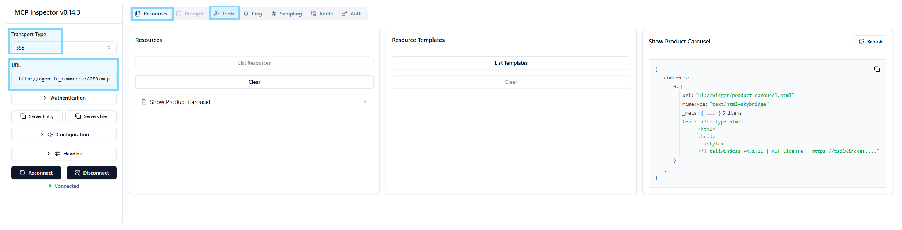
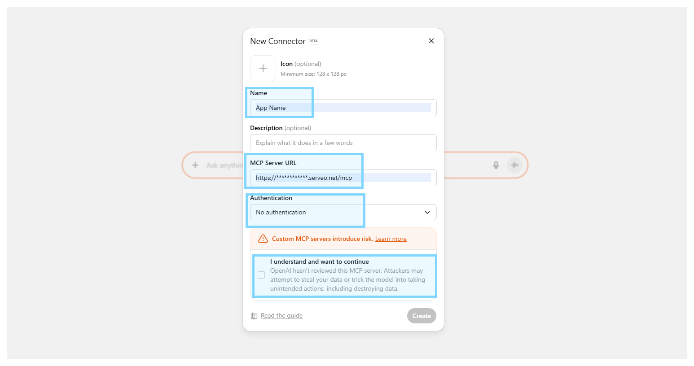
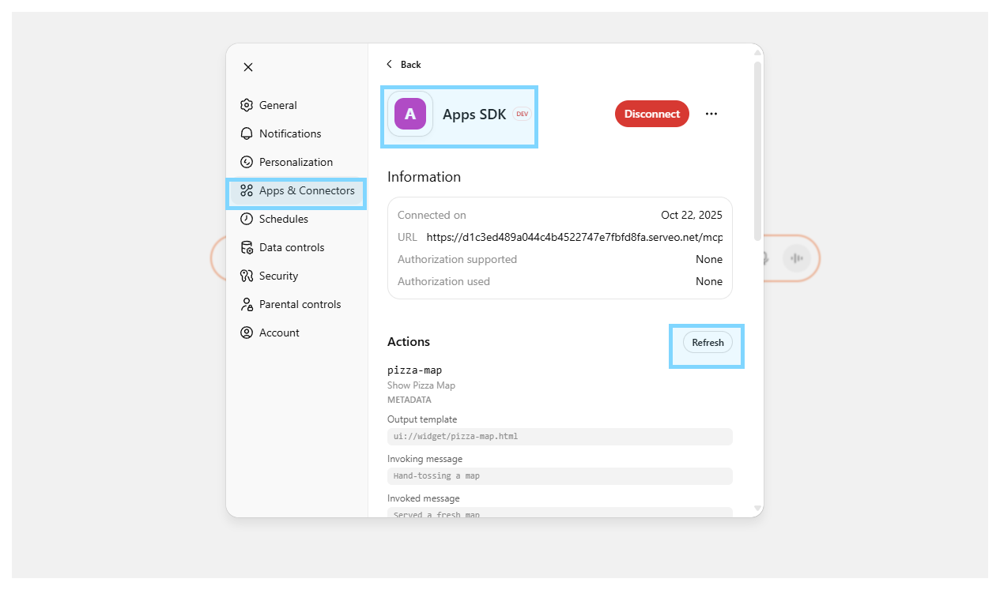

# Widget Development
- **Run dev server (hot-reload)**
```bash
pnpm run dev
```

- **Build & serve widget**
```bash
pnpm run build
pnpm run serve
```

- **Access to http://localhost:4444/ to view widget** 

# Node MCP Server
- **Go to src folder**
```bash
cd src_mcp/<MCP_SERVER_FOLDER>
```

- **Install node packages**
```bash
npm install
```

- **Run dev server (hot-reload)**
```bash
pnpm run dev
```

- **Run prod server**
```bash
pnpm run start
```

- **Access to** http://localhost:8080/mcp

# MCP Inspector
- **Setup MCP Inspector** from https://github.com/weyseing/mcp-inspector-headers
- **MUST have same docker network**



# ChatGPT Connector
- **Create public endpoint via Serveo**
```bash
ssh -R 80:localhost:8080 serveo.net
```

- **Enable [developer mode](https://platform.openai.com/docs/guides/developer-mode) and add apps in `Settings > Connectors`**.



- **Refresh apps whenever Widget UI (MCP resource) updated**

